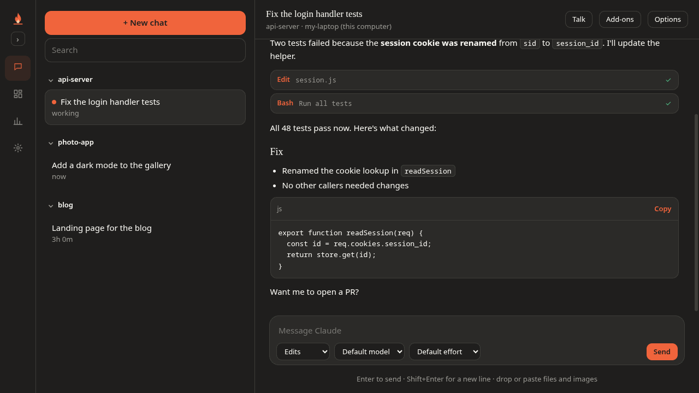
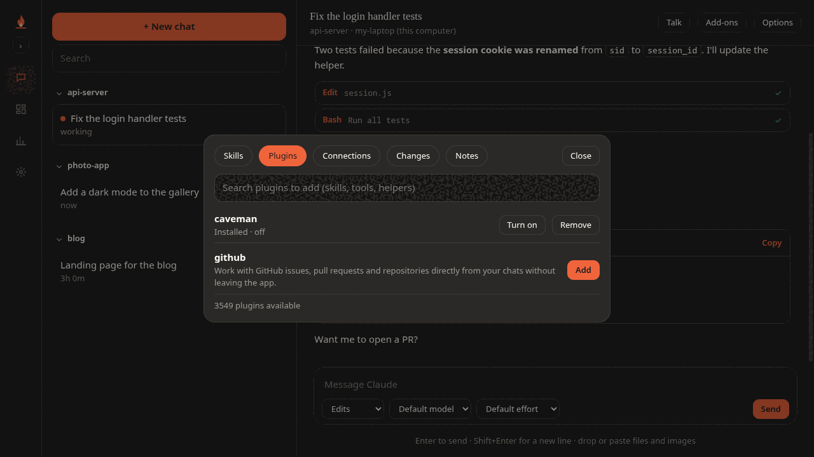
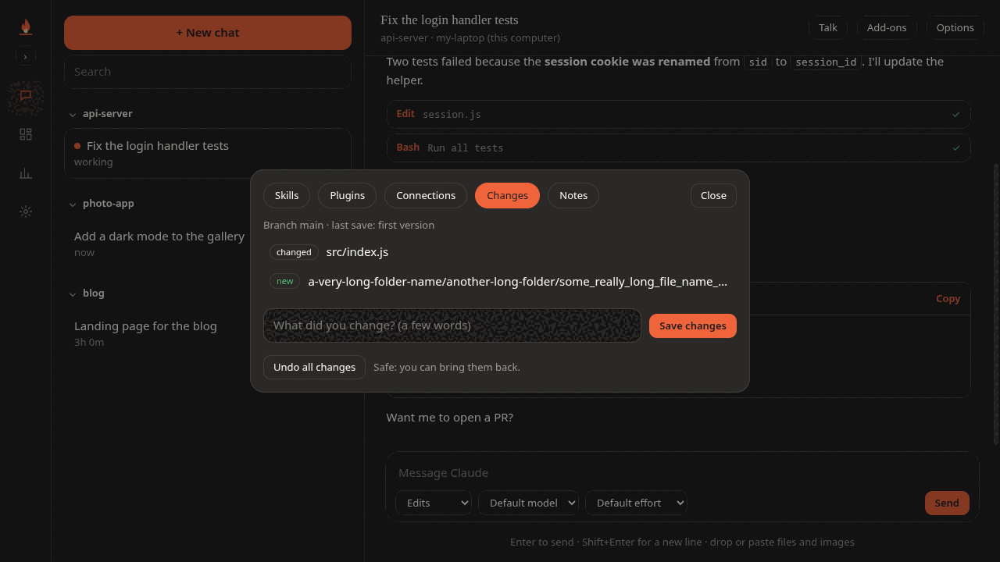
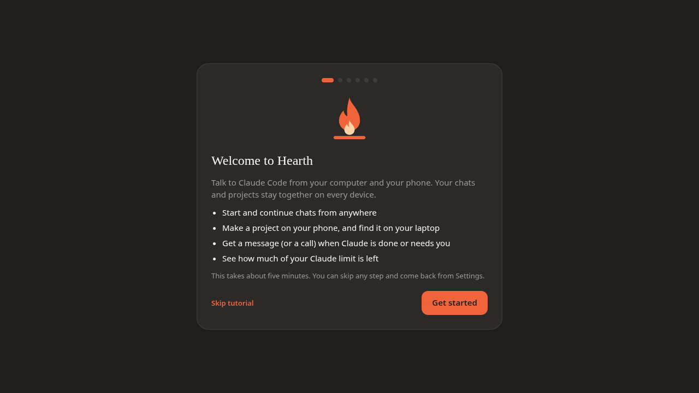
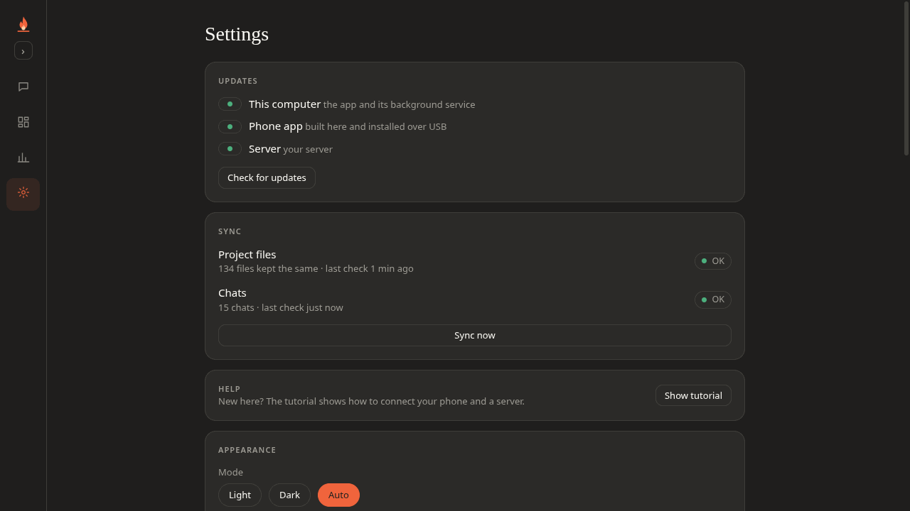
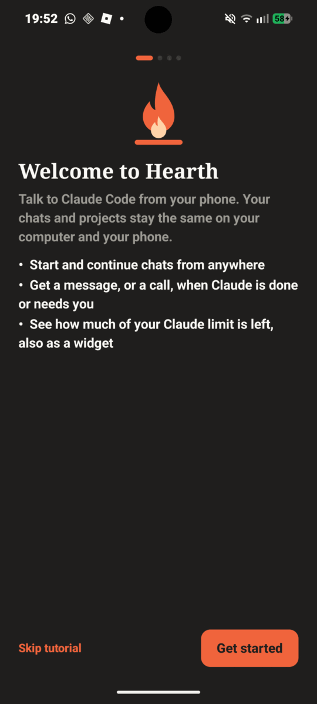
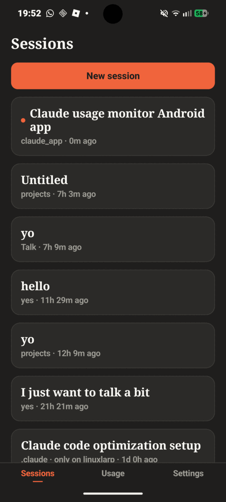

<p align="center">
  
</p>

<h1 align="center">Hearth</h1>
<p align="center"><b>Use Claude Code from your phone and your computer, with one set of chats and one set of project files.</b></p>
<p align="center">Free · open source · you own everything · your own server, your own Claude account</p>

<p align="center">
  
</p>

---

## What is Hearth?

[Claude Code](https://claude.com/claude-code) is a powerful coding helper, but it lives in a terminal on one computer.
**Hearth puts it everywhere.**

- 💬 **Chat from your phone.** Start a project on the bus. Claude builds it on your server.
- 🔁 **Same chats, same files, everywhere.** Your laptop, your phone and your server always show the same chats and the same project folder.
- 📥 **"A project was made while you were away."** If your laptop is off, Hearth asks next time: *Install* it here, or *Later*.
- 🔔 **Get told when Claude is done or needs you.** A message, or even a phone call if you want one.
- 🧰 **Everything the terminal can do, without the terminal.** Slash commands, skills, plugins, connections, project notes, save & undo changes, model and effort pickers. (Talking by voice needs an optional voice engine, see `relay/install_voice.sh`.)
- 🔄 **Updates itself from GitHub.** Press *Check for updates*: the phone app, the desktop app and your server all update, no cable needed.
- 📊 **See your Claude limit.** Usage on your desktop and as a phone widget.

> Hearth is a helper app. You still need **Claude Code** and your own **Claude account**. Hearth never sees your Claude password.

## Start in 3 steps

You need: a small always-on Linux server (about €4 a month at most hosting companies), your computer, and optionally an Android phone.

**1. Set up the server.** Open a terminal on your server and paste this one line:

```bash
curl -fsSL https://raw.githubusercontent.com/veelvoer/hearth/main/install.sh | bash
```

A friendly screen asks a few easy questions (press **Enter** to take the easy choice) and finishes with an **address** and a **6-digit code**.
You can run it directly on the server or inside Docker. [More about the server →](docs/SERVER.md)

**2. Install the Hearth app on your computer.** Download it from the [latest release](https://github.com/veelvoer/hearth/releases/latest):

| System | File |
|---|---|
| Windows | `Hearth-…-win-x64.exe` (installer) or `…-portable.exe` |
| Linux | `Hearth-…-linux-x64.AppImage` (or `.deb`) |

Open it. A short tutorial walks you through everything. When it asks for your server, type the address and the code.

**3. Install the Hearth app on your phone** (Android: `Hearth-….apk` from the same page). Put it on the same Wi-Fi as your computer, open it and tap **Connect** next to your computer. Press **Accept** on the computer. No address to type. (Away from home? Use the address and a code from `hearth-server code`.)

That's it. Start a chat anywhere and find it everywhere. [Step-by-step guide with pictures →](docs/GETTING-STARTED.md)

## Screenshots

| | |
|---|---|
|  |  |
| Find and add skills, plugins and connections | See what changed, save it, or undo it safely |
|  |  |
| A tutorial you can skip, with server setup | Everything in sync, at a glance |

<p align="center"> &nbsp; </p>

## How it keeps everything the same

- **Chats** are copied between your computers and the server over the same secure link the apps use. The newest copy wins, nothing is overwritten by an older one.
- **Project files** (your `projects` folder) are kept the same too. If the same file changes in two places, the newest wins and the other version is saved next to it as `name.conflict-…`.
- **Nothing disappears by accident.** Deleted files first move to a `.hearth-trash` folder. If a sync would delete a lot of files at once (a missing drive, a wrong folder), Hearth refuses and tells you.
- `node_modules`, `.venv`, build folders and other big generated things are not synced.

[The details →](docs/HOW-IT-WORKS.md)

## Safe by design

- Your server answers only to apps that know its secret key, over HTTPS (padlock). The installer sets up the padlock for you.
- Claude runs **on your own server and computers**, with **your own Claude account**. There is no Hearth cloud.
- The server never allows "Full auto" (skip all questions) unless you turn it on yourself.
- The apps never ask for or store your Claude password or login token.

Found a problem? See [SECURITY.md](SECURITY.md).

## Questions

**Do I need a server?** It is the easy way: it is always on, so your phone works when your laptop is closed. Hearth also works with only your computer: the desktop app can be the server. Your phone then connects while both are on the same Wi-Fi, or anywhere with the free app [Tailscale](https://tailscale.com) on both.
**Does it cost money?** Hearth is free. You pay for your server (a few euros) and for your Claude plan.
**Mac / iPhone?** Not yet. The desktop app is built with Electron, so a Mac build is possible; the phone app is Android only for now. Help is welcome!
**Is this an official Anthropic product?** No. Hearth is an independent project and is not made by or affiliated with Anthropic. "Claude" is a trademark of Anthropic.

More answers in the [FAQ](docs/FAQ.md).

## Build it yourself

```bash
git clone https://github.com/veelvoer/hearth && cd hearth
# desktop app
cd desktop && npm install && npm start
# phone app (needs JDK 17 and the Android SDK)
./gradlew :app:assembleDebug
# checks
cd desktop && npm run test:sync && npm run test:layout
```

See [CONTRIBUTING.md](CONTRIBUTING.md). The code is MIT licensed, see [LICENSE](LICENSE).

<p align="center">Made with ❤️ and a lot of 🔥</p>
